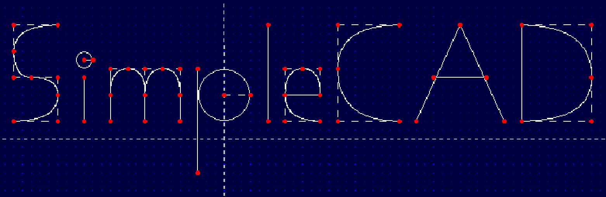

<!--
*** Thanks for checking out the Best-README-Template. If you have a suggestion
*** that would make this better, please fork the repo and create a pull request
*** or simply open an issue with the tag "enhancement".
*** Thanks again! Now go create something AMAZING! :D
***
***
***
*** To avoid retyping too much info. Do a search and replace for the following:
*** github_username, repo_name, twitter_handle, email, project_title, project_description
-->


<!-- PROJECT SHIELDS -->
<!--
*** I'm using markdown "reference style" links for readability.
*** Reference links are enclosed in brackets [ ] instead of parentheses ( ).
*** See the bottom of this document for the declaration of the reference variables
*** for contributors-url, forks-url, etc. This is an optional, concise syntax you may use.
*** https://www.markdownguide.org/basic-syntax/#reference-style-links
-->
[![Contributors][contributors-shield]][contributors-url]
[![Forks][forks-shield]][forks-url]
[![Stargazers][stars-shield]][stars-url]
[![Issues][issues-shield]][issues-url]
[![MIT License][license-shield]][license-url]
[![LinkedIn][linkedin-shield]][linkedin-url]
[![Made With][forthebadge made-with-c++]][c++-url]


<!-- PROJECT LOGO -->
<br />
<p align="center">
  <a href="https://github.com/Vincentho711/SimpleCAD">
    
  </a>

  <h3 align="center">SimpleCAD</h3>

  <p align="center">
    A simple CAD program to illustrate ideas and develop 2D models.
    <br />
    <br />
    <a href="https://github.com/Vincentho711/SimpleCAD">View Demo(Coming up!)</a>
    ·
    <a href="https://github.com/Vincentho711/SimpleCAD/issues/new">Report Bug</a>
    ·
    <a href="https://github.com/Vincentho711/SimpleCAD/issues/new">Request Feature</a>
  </p>
</p>


<!-- TABLE OF CONTENTS -->
<details open="open">
  <summary><h2 style="display: inline-block"> 📚Table of Contents</h2></summary>
  <ol>
    <li>
      <a href="#about-the-project">About The Project</a>
      <ul>
        <li><a href="#built-with">Built With</a></li>
      </ul>
    </li>
    <li>
      <a href="#getting-started">Getting Started</a>
      <ul>
        <li><a href="#prerequisites">Prerequisites</a></li>
        <li><a href="#installation">Installation</a></li>
      </ul>
    </li>
    <li><a href="#usage">Usage</a></li>
    <li><a href="#roadmap">Roadmap</a></li>
    <li><a href="#contributing">Contributing</a></li>
    <li><a href="#license">License</a></li>
    <li><a href="#contact">Contact</a></li>
    <li><a href="#acknowledgements">Acknowledgements</a></li>
  </ol>
</details>


<!-- ABOUT THE PROJECT -->
## 💡About The Project
<!--
[![Product Name Screen Shot][product-screenshot]](https://example.com)
-->
This project is built entirely on C++. It is a 2D CAD tool which allows users to draw shapes and lines to illustrate ideas.
<!--
**To avoid retyping too much info. Do a search and replace with your text editor for the following:**
`github_username`, `repo_name`, `twitter_handle`, `email`, `project_title`, `project_description`
-->

### Built With
* [C++](https://isocpp.org/)
* [olcPixelGameEngine](https://github.com/OneLoneCoder/olcPixelGameEngine)


<!-- GETTING STARTED -->
## 🎉Getting Started

To get a local copy up and running follow these simple steps.

### 🔖 Prerequisites

Before using this library, ensure you have an IDE and the relevent C++ compiler installed.


### 🔧 Installation

1. Clone the repo
   ```sh
   git clone https://github.com/Vincentho711/SimpleCAD.git
   ```
2. Open the project on your IDE.

3. Compile the program and run it.


<!-- USAGE EXAMPLES -->
## 📦 Usage

A separate window will pop up once it is running. You can draw shapes, lines and curves by pressing keys. Currently
the supported shapes and features are:
- Lines: `l` key
- Boxes: `b` key
- Circles: `c` key
- Spline/ curve: `s` key
- Modify shapes: Put cursor on node to be modified, then press `m` key
- Delete shapes: Put cursor on a node of the shape to be deleted, then press `d` key
- Change colour: There are currently 5 colour presets (GREEN, RED, BLACK, MAGENTA and WHITE), press `space` to cycle between them

_[Documentation](https://example.com)_ is coming up!


<!-- ROADMAP -->
## 🚩 Roadmap

See the [open issues](https://github.com/Vincentho711/SimpleCAD/issues) for a list of proposed features (and known issues).

### ✨ Milestone Summary

| Status | Milestone | Goals | ETA |
| :---: | :--- | :---: | :---: |
| ✅ | **[Implement the ability to delete shapes]** | 1 / 1 | 01 Jan 2022 |
| 🚧 | **[Implement the ability to select multiple shapes]** | 0 / 1 | 20 Jan 2022 |

### Implement the ability to delete shapes

> This milestone will be done when 
* Shapes can be deleted

### Implement the ability to select multiple shapes

> This milestone will be done when 
* Shapes can be selected with visual confirmation
* Actions can be made after selection


<!-- CONTRIBUTING -->
## 💝 Contributing

Contributions are what make the open source community such an amazing place to be learn, inspire, and create. Any contributions you make are **greatly appreciated**.

1. Fork the Project
2. Create your Feature Branch (`git checkout -b feature/AmazingFeature`)
3. Commit your Changes (`git commit -m 'Add some AmazingFeature'`)
4. Push to the Branch (`git push origin feature/AmazingFeature`)
5. Open a Pull Request


<!-- LICENSE -->
## 📜 License

Distributed under the MIT License. See `LICENSE` for more information.


<!-- CONTACT -->
## 😃 Contact

Vincent Ho - [LinkedIn](https://www.linkedin.com/in/vincent-ho-b0932b138/)


<!-- ACKNOWLEDGEMENTS -->
## ⭐ Acknowledgements

* [Javidx9](https://github.com/OneLoneCoder)


<!-- MARKDOWN LINKS & IMAGES -->
<!-- https://www.markdownguide.org/basic-syntax/#reference-style-links -->
[contributors-shield]: https://img.shields.io/github/contributors/Vincentho711/SimpleCAD?style=for-the-badge
[contributors-url]: https://github.com/Vincentho711/SimpleCAD/graphs/contributors
[forks-shield]: https://img.shields.io/github/forks/Vincentho711/SimpleCAD?style=for-the-badge
[forks-url]: https://github.com/Vincentho711/SimpleCAD/network/members
[stars-shield]: https://img.shields.io/github/stars/Vincentho711/SimpleCAD?style=for-the-badge
[stars-url]: https://github.com/Vincentho711/SimpleCAD/stargazers
[issues-shield]: https://img.shields.io/github/issues/Vincentho711/SimpleCAD?style=for-the-badge
[issues-url]: https://github.com/Vincentho711/SimpleCAD/issues
[license-shield]: https://img.shields.io/github/license/Vincentho711/SimpleCAD?style=for-the-badge
[license-url]: https://github.com/github_username/repo/blob/master/LICENSE.txt
[linkedin-shield]: https://img.shields.io/badge/-LinkedIn-black.svg?style=for-the-badge&logo=linkedin&colorB=555
[linkedin-url]: https://www.linkedin.com/in/vincent-ho-b0932b138/
[forthebadge made-with-c++]: https://forthebadge.com/images/badges/made-with-c-plus-plus.svg
[c++-url]: https://isocpp.org/